# 🚀DirectX12
- DirectX12와 관련된 학습 내용입니다.

- 최종 결과 (추후에 추가할 예정입니다)　

#

## 🌳 목차
1. DirectX12 Initialization
2. Component
3. Vector & Matrix
4. Camera & Lighting
5. Quaternion
6. Rendering
7. Particle
8. Shadow Mapping
9. Terrian
10. Mesh & Animation

## ☑ TODO
- [x] Start project (2021.06.07, 2021.09.06)
- [x] 최초 프로젝트 설정 및 셋팅 (2021.06.07) / https://blog.naver.com/610ksh/222388342098
- [x] 장치 초기화 (06.08) / https://blog.naver.com/610ksh/222389757864
- [x] 삼각형 띄우기 (2021.09.08) / https://blog.naver.com/610ksh/222392496872
- [x] Constant Buffer View(CBV) (09.09) / https://blog.naver.com/610ksh/222415510639
- [x] Descriptor Table(DescriptorHeap) (09.10) / https://blog.naver.com/610ksh/222417967521
- [x] Index Buffer (09.13) / https://blog.naver.com/610ksh/222418610083
- [x] Texture Mapping (09.14) / https://blog.naver.com/610ksh/222505298506
- [x] Depth Stencil View (09.15) / https://blog.naver.com/610ksh/222506519945
- [x] Input & Timer (09.16) / https://blog.naver.com/610ksh/222508029404
- [x] Material (09.17) / https://blog.naver.com/610ksh/222509237814
- [x] Component (09.18) / https://blog.naver.com/610ksh/222509738386
- [x] Scene (09.19) / https://blog.naver.com/610ksh/222510823338
- [x] Trigonometry & Vector & Matrix (09.21) / https://blog.naver.com/610ksh/222512188442
- [x] Coordinate Transformation(World, View Matrix) (09.24) / https://blog.naver.com/610ksh/222513116337
- [x] Projection, Screen Transformation (09.25) / https://blog.naver.com/610ksh/222516565902
- [x] Camera (09.27, 28) / https://blog.naver.com/610ksh/222518630108
- [x] Resource (10.05) / https://blog.naver.com/610ksh/222527858327
- [x] Lighting (10.06) / https://blog.naver.com/610ksh/222528751409
- [x] Normal Mapping (10.07) / https://blog.naver.com/610ksh/222530689058
- [x] Skybox (10.08) / https://blog.naver.com/610ksh/222531160911
- [x] Frustum Culling (10.09) / https://blog.naver.com/610ksh/222531953169
- [x] Quaternion (10.10) / https://blog.naver.com/610ksh/222532786353
- [x] Orthographic projection (11.02) / https://blog.naver.com/610ksh/222556372871
- [ ] Render Target (11.03)
- [ ] Deferred Rendering (11.04)
- [ ] Compute Shader (11.05)
- [ ] Particle System (11.06)
- [ ] Instancing (11.07)
- [ ] Shadow Mapping (11.08)
- [ ] Tessellation (11.09)
- [ ] Terrain (11.10)
- [ ] Picking (11.11)
- [ ] Mesh (11.12)
- [ ] Animation (11.13)

## :heavy_check_mark: Languages & Library
- Visual Studio 2017
- C++
- DirectX12
- d3dx12.h (Helper 클래스) / https://github.com/microsoft/DirectX-Graphics-Samples/blob/master/Libraries/D3D12RaytracingFallback/Include/d3dx12.h
- DirectXTex (MS, 이미지 파일 업로드 라이브러리) / https://github.com/microsoft/DirectXTex
- dx12 SimpleMath.h / https://github.com/microsoft/DirectXTK12
- gitignore : Visual Studio, C++

---
# 🎨Chapter1. DirectX12 초기화
## Lecture1. 시작하기
### 1. 프로젝트 셋팅 & 장치 초기화 완료(초기화면)
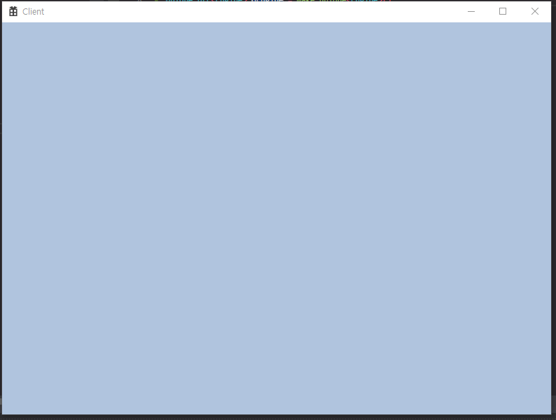

### 2. 삼각형 띄우기 (VertexBuffer, VertexBufferView = VBV)
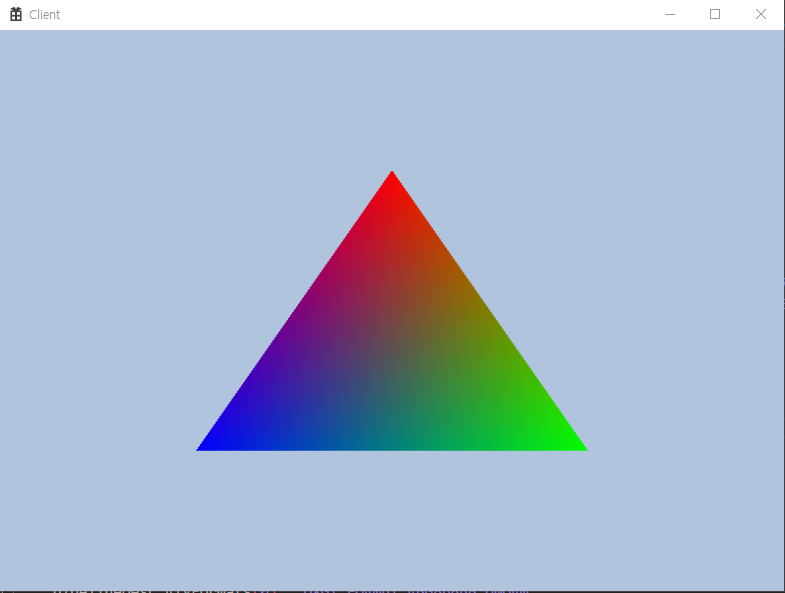

### 3. Constant Buffer (ConstantBufferView)
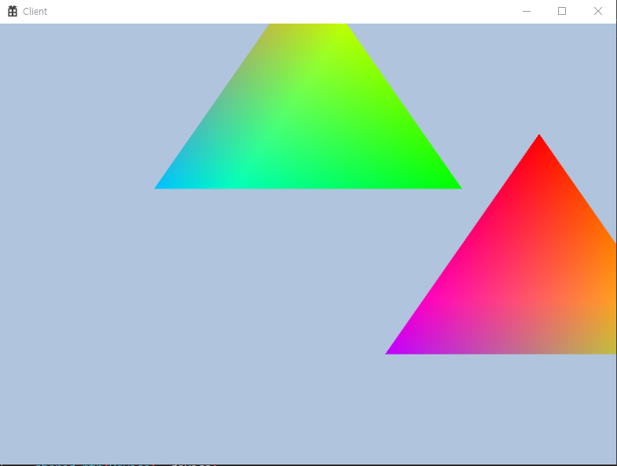
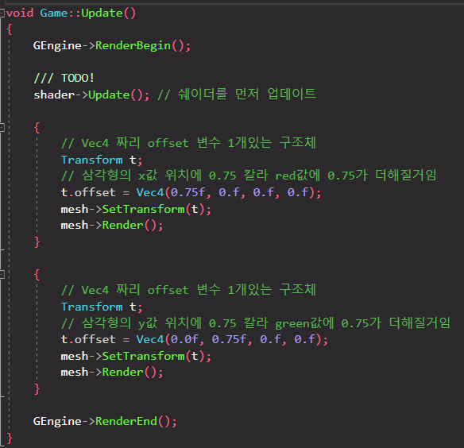

### 4. Descriptor table
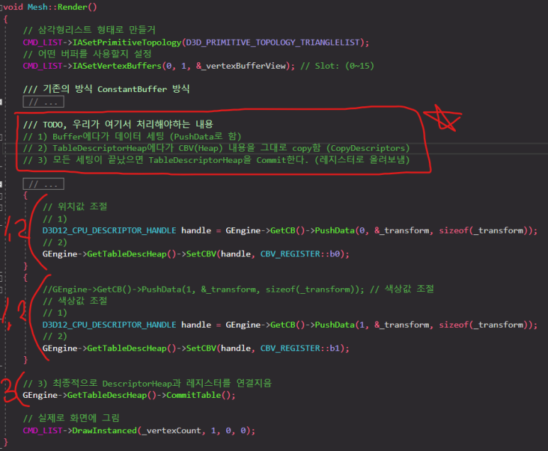

### 5. Index Buffer (IndexBufferView)
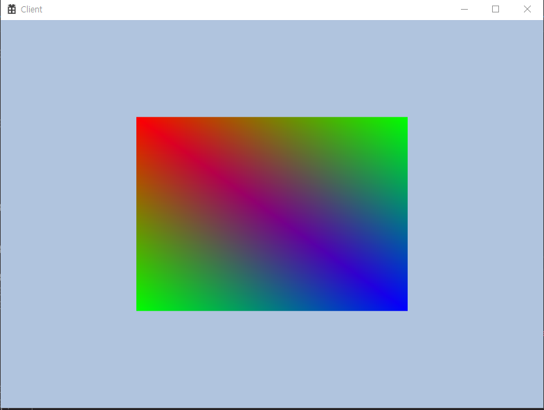

### 6. Texture Mapping
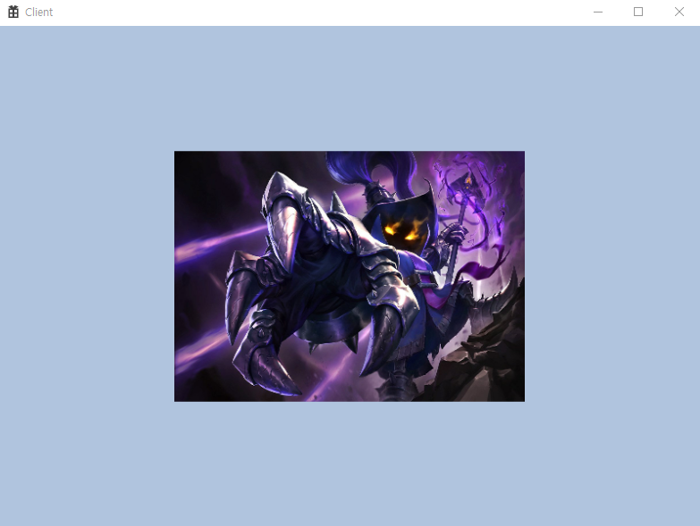

### 7. Depth Stencil View (Depth Buffer)
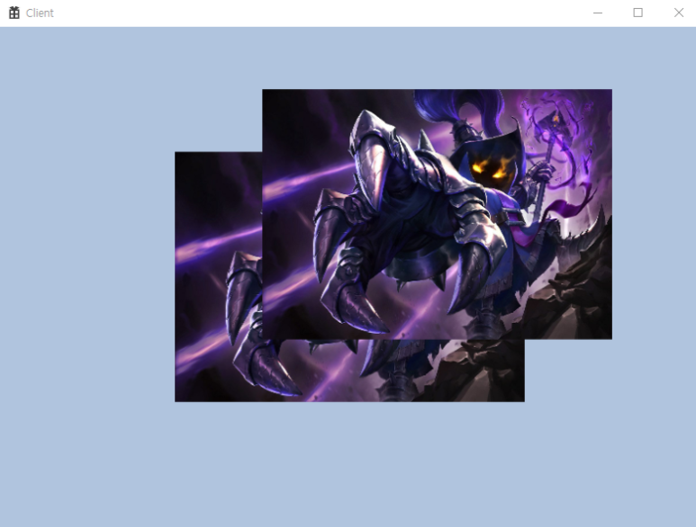

---
# 🎨Chapter2. Component
## 2-1. Input & Timer

## 2-2. Material
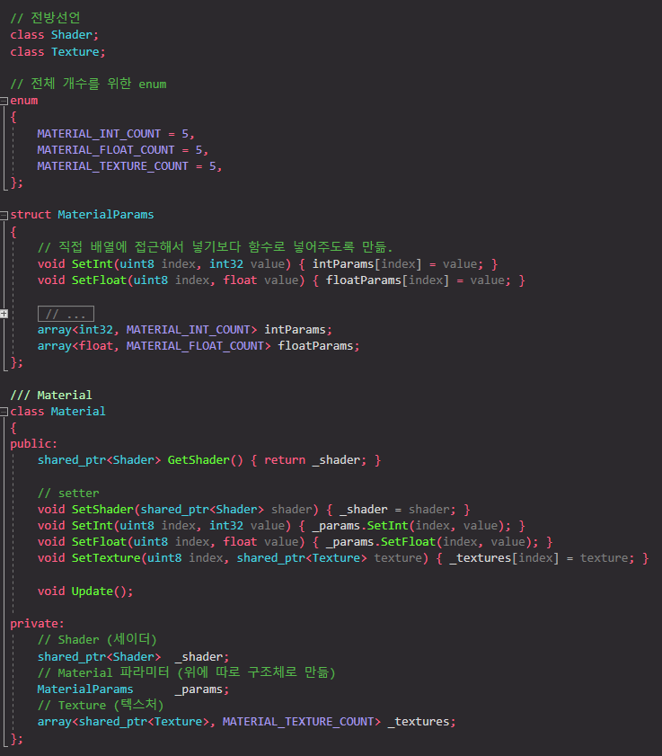

## 2-3. Component
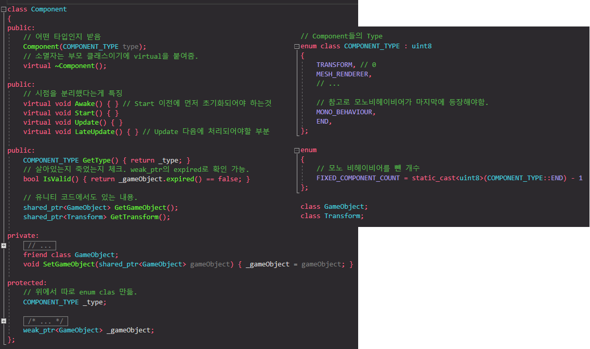

## 2-4. Scene
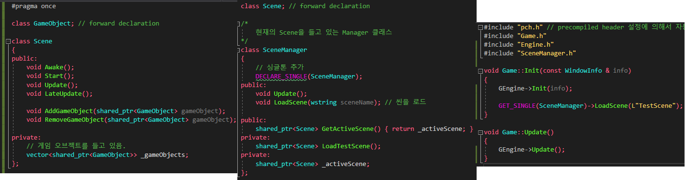

---
# 🎨Chapter3. Vector & Matrix
### 3-1. 추가 예정

### 3-2. 추가 예정

### 3-3. 추가 예정

---
# 🎨Chapter4. Camera & Lighting
## 4-1. Camera

## 4-2. Resource

## 4-3. Lighting

## 4-4. Normal Mapping
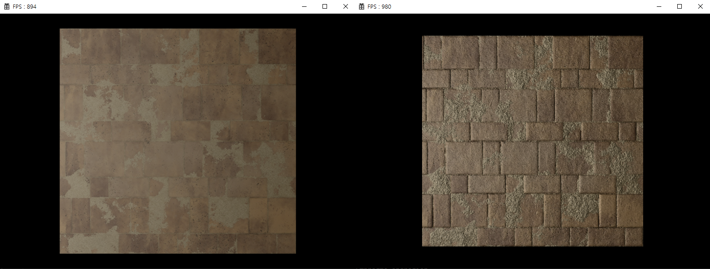

## 4-5. Skybox

## 4-6. Frustum Culling
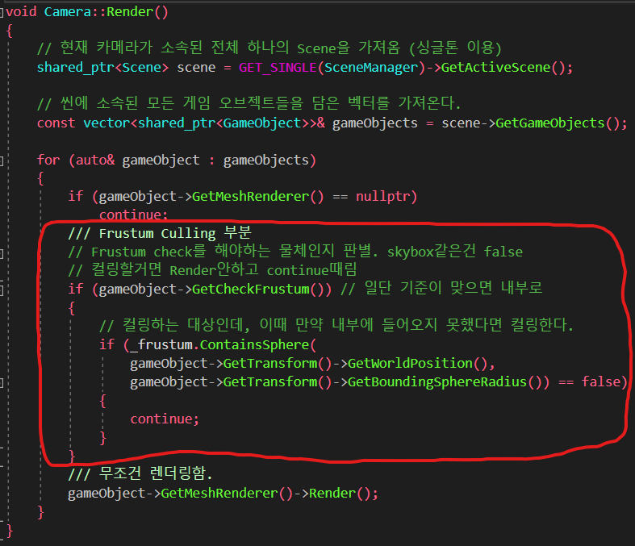

---
# 🎨Chapter5. Quaternion
### 1. 오일러각과 짐벌락 현상
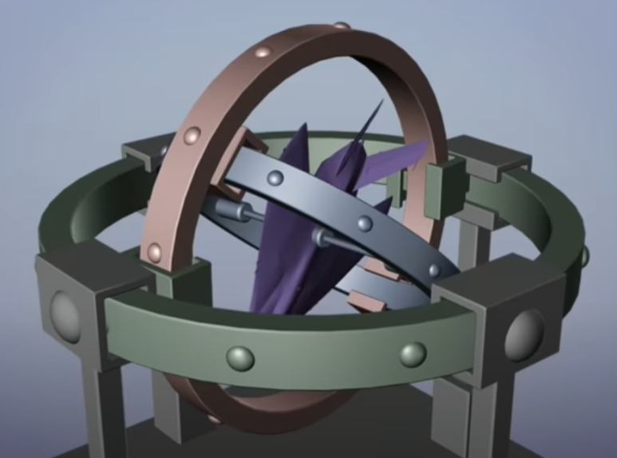

### 2. 2차원 Quaternion
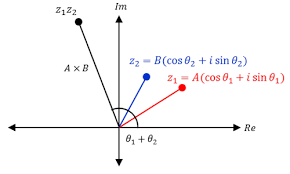

## 3. 3차원 Quaternion
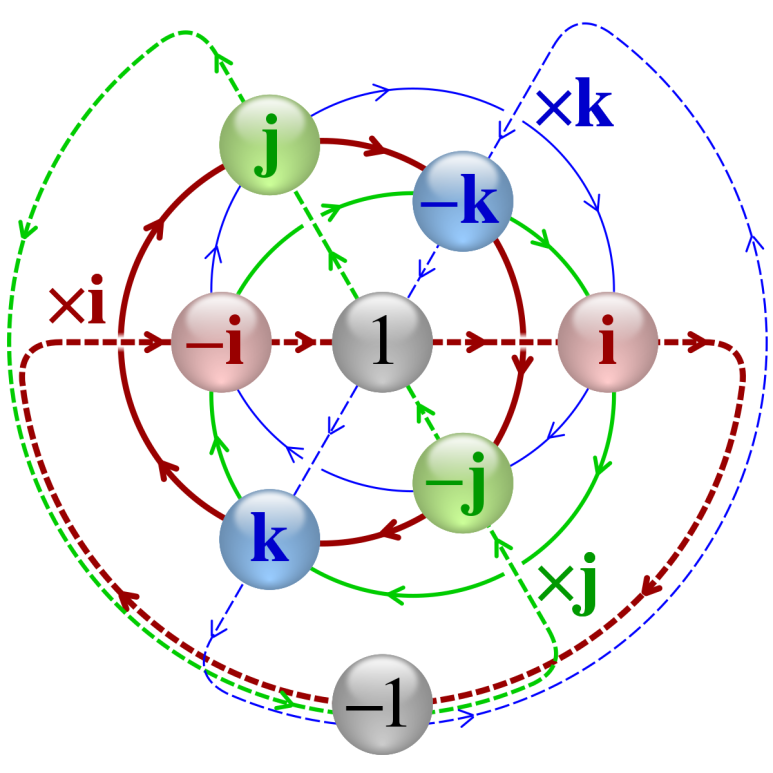
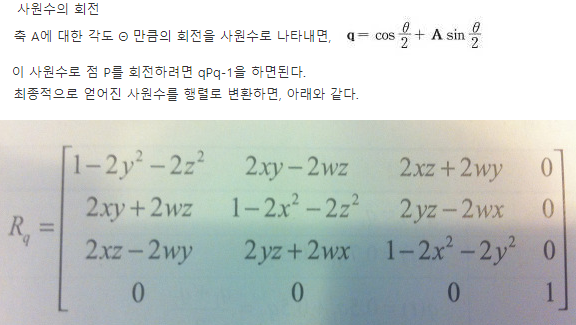

---
# 🎨Chapter6. Rendering
## 1. Orthographic Projection (for UI)

### 2. x

### 3. x

---
# 🎨Chapter7. Particle
## Lecture1. 시작하기
### 1. x

### 2. x

### 3. x

---
# 🎨Chapter8. Shadow Mapping
## Lecture1. 시작하기
### 1. x

### 2. x

### 3. x

---
# 🎨Chapter9. Terrian
## Lecture1. 시작하기
### 1. x

### 2. x

### 3. x

---
# 🎨Chapter10. Mesh & Animation
## Lecture1. 시작하기
### 1. x

### 2. x

### 3. x

---

## MIT License
The class is licensed under the [MIT License](http://opensource.org/licenses/MIT):

Copyright 2021. [SungHoon](https://github.com/610ksh) all rights reserved.
